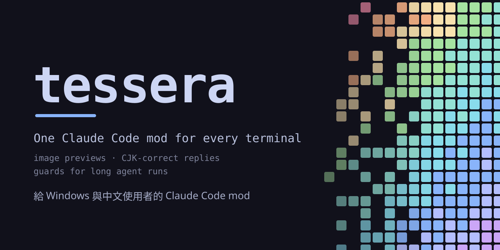
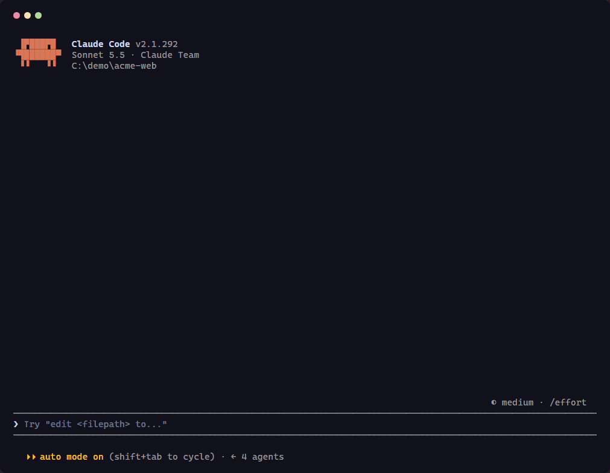

<p align="center">
  
</p>

<p align="center">
  <a href="https://github.com/OG-Matcha/tessera/actions/workflows/ci.yml"></a>
  <a href="https://github.com/OG-Matcha/tessera/releases"></a>
  <a href="LICENSE"></a>
  
  
</p>

<p align="center">
  
  <br><sub>錄自一般終端機裡的真實 session：貼上的 log 送出前就能預覽，回覆畫出中文對齊的表格；寫入簡體字時繁簡守門先擋一次，Claude 確認是引用原文後才再送。</sub>
</p>

<p align="center">
  <a href="README.md">English</a> · 繁體中文
</p>

**tessera** 是一個 [Claude Code mod](https://code.claude.com/docs/en/plugins/mods/overview)：把 Claude Code 藏起來的東西顯示出來，並擋下會讓你損失工作的錯誤。貼上的圖片和文字看得到、回覆裡的表格和圖表中文不跑版、長時間的多 agent 執行有守門。裝一個就好，每項功能都能開關，關掉的功能完全不佔資源。

## 解決了什麼

| 問題 | 回報 | tessera |
| --- | --- | --- |
| 在多數終端機裡，貼上的圖只顯示 `[Image #1]` | | 輸入框上方顯示縮圖：kitty、Ghostty 顯示原圖，其他終端機用色塊 |
| 貼上的文字送出前就被摺疊成 `[Pasted text #1 +40 lines]` | [#23134](https://github.com/anthropics/claude-code/issues/23134) | 在輸入框上方顯示前幾行 |
| 韓文、中文、日文被寫成 `\uXXXX`，結果變成錯字 | [#83033](https://github.com/anthropics/claude-code/issues/83033) | 寫入前就擋下 |
| 用中文問問題，因為貼的 log 是英文，Claude 就用英文回答 | | 依你自己打的字的語言回覆 |
| 寫繁中專案時，Claude 寫進簡體字或簡中用語 | | 擋下一次，並列出 zh-TW 寫法 |
| 開新 session 或 `/clear` 之後，忘了上次還有什麼沒做 | | 輸入框上方提示沒做完的待辦 |
| 改一次檔，差異就塞滿整個畫面 | | 只顯示刪掉和新增的前幾行、增刪行數和「展開」按鈕 |
| Read 工具沒顯示讀了哪個檔 | [#21151](https://github.com/anthropics/claude-code/issues/21151) | 工具列會顯示檔名 |
| 從終端機複製會多出縮排和行尾空白 | [#18170](https://github.com/anthropics/claude-code/issues/18170) | 複製按鈕和 `/tessera copy` 複製出乾淨的文字 |

## 安裝

```sh
claude plugin marketplace add OG-Matcha/tessera
claude plugin install tessera@tessera --scope user
```

開一個新 session，輸入 `/tessera setup` 選擇要開的功能。

想自動收到新版本：開啟 `/plugin`，到 **Marketplaces** 選 **tessera**，再選 **Enable auto-update**。Anthropic 官方以外的 marketplace，Claude Code 預設不自動更新；tessera 會在輸入框上方提醒你一次，按鈕會幫你打開 `/plugin`。沒開的話，可以手動更新：

```sh
claude plugin marketplace update tessera
claude plugin update tessera@tessera
```

> [!IMPORTANT]
> tessera 已經包含 [prismantis](https://github.com/NahumLitvin/prismantis) 的回覆美化，以及 [cc-mod-image-view](https://github.com/GGGODLIN/cc-mod-image-view) 的貼圖預覽概念。請先移除這兩個 mod，兩個 mod 畫同一塊畫面會互相衝突。

## 功能

| 功能 | 預設 | 說明 |
| --- | --- | --- |
| 回覆美化 | 開 | 表格、標題、程式碼上色、mermaid 圖表、工具列、複製按鈕；16 套主題 |
| 摺疊長差異 | 開 | Edit、Write 的差異超過 12 行時，最多顯示 8 行（刪掉的前幾行和新增的前幾行）、增刪行數和 **展開**；ctrl+o 和 `--verbose` 顯示全部。只改顯示，Claude 讀到的內容不變 |
| 貼上預覽 | 開 | 輸入框上方顯示圖片縮圖和被摺疊的文字（文字從剪貼簿讀取，行數和貼上的一致才顯示）；「原圖」會在 Orca 分頁、VS Code 分頁或系統檢視器開啟 |
| 用我的語言回覆 | 開 | 你自己打的字是中文、日文或韓文時，Claude 用同一種語言回覆；貼上的程式碼、log、引用不算 |
| 接續未完成 | 開 | 新 session 或 `/clear` 之後，會提示這個 repo 上次沒做完的待辦：**接續** 把它們填進輸入框，**略過** 就不再提。它會在 session 裡替 Claude 打開待辦工具（`CLAUDE_CODE_ENABLE_TODO_TOOLS`，Claude Code 對 Claude 5.x 預設不開），你自己設過這個變數就照你的設定；打開後 Claude 可能在畫面上列出待辦清單（`Ctrl+T` 收起） |
| 中日韓跳脫守門 | 開 | 擋下把中日韓文字寫成 `\uXXXX` |
| 繁簡守門 | 自動 | 你用繁體中文時，擋下寫進檔案的簡體字和簡中用語，並列出繁中慣用寫法（`这→這`、`服務器→伺服器`）；zh-CN 檔案、本來就是簡體的檔案、檔案裡原本就用的詞、日文行不檢查 |

Claude 替其他 agent 或工具寫的 prompt，會畫成一張附 token 估計和複製按鈕的卡片。

### 防呆

預設開啟，平常不會出聲，出事時才擋。

| 功能 | 預設 | 說明 |
| --- | --- | --- |
| 工作區守門 | 開 | 擋下穿過連結的遞迴刪除、連到 `node_modules` 的連結；強制推送到 `main` 或 `master` 前，以及 `git reset --hard`、`git checkout -- <路徑>`、`git restore`、`git clean -f` 會丟掉未提交的改動前，列出檔案提醒一次；agent 執行時擋下改寫主樹和 `git add -A` |
| heredoc 守門 | 開 | Bash 的 heredoc 分隔符號沒加引號（`<<EOF`），內文又會被 shell 改掉時擋下：`${x}`、`$(cmd)`、反引號被展開，`\\` 變成 `\`；確定要展開就再送一次 |
| agent 自動選模型 | 自動 | 沒指定模型的 agent，由一次簡短的 Haiku 判斷依任務挑 haiku、sonnet、opus 或 fable，並跳通知告訴你；`choose` 則要求 Claude 自己指定。沒指定模型的 Workflow 腳本會被提醒一次，請 Claude 替每個 `agent()` 指定 |

### 選用

預設關閉，適合特定工作流程，在 `/tessera setup` 打開。

| 功能 | 預設 | 說明 |
| --- | --- | --- |
| 用語表守門 | 關 | repo 的 `CLAUDE.md` 有含 **用語** 和 **避免** 兩欄的表格時，寫入檔案帶到「避免」的寫法就擋下並列出該用的詞；沒有這種表格就什麼都不做 |
| Workflow 引用原話 | 關 | Workflow 腳本必須逐字引用你說過的話，agent 才不會因為你後來的一句提問就停工 |
| 客戶回饋收件匣 | 關 | 貼上的聊天紀錄（`22:55 名字 訊息`）變成編號項目；和已修項目相似的抱怨會標成可能回歸 |
| 額度重置後續跑 | 關 | 額度用完中斷後，在重置後一分鐘自動繼續 |

## 指令

| 指令 | 用途 |
| --- | --- |
| `/tessera setup` | 開關各項功能 |
| `/tessera peek <檔案>` | 在終端機預覽 Markdown、CSV、JSON、docx、xlsx、pptx |
| `/tessera copy` · `copy code` · `copy prompt` | 複製上一則回覆、最後一個程式碼區塊或 prompt 卡片 |
| `/tessera inbox` · `inbox fixed 3 5` | 列出收件匣、以目前的 commit 標記已修 |
| `/tessera theme <名稱>` | 換主題 |
| `/tessera demo` | 示範所有元素 |

輸入 `/tessera ` 再打一個字母，就會出現附說明的建議。

## 終端機

| 終端機 | 貼圖預覽 | 「原圖」開在 |
| --- | --- | --- |
| kitty、Ghostty | 原圖 | 系統檢視器 |
| Windows Terminal、iTerm2、Apple Terminal、SSH | 色塊 | 系統檢視器（`explorer`、`open`、`xdg-open`） |
| Orca | 色塊 | Orca 瀏覽器分頁 |
| VS Code、Cursor | 色塊 | VS Code 分頁 |
| tmux、screen 裡 | 色塊 | 同上 |
| WSL | 色塊 | 透過 `\\wsl.localhost` 用 Windows 檢視器 |

偵測不準時，在 `/config` 把 `imageMode` 設成 `pixels` 或 `cells`。Orca 能畫 kitty 圖片，但還不支援 Claude Code 使用的 Unicode 佔位字元（[stablyai/orca#23615](https://github.com/stablyai/orca/issues/23615)）。

## 在你電腦上做了什麼

自己不連網：唯一的模型呼叫，是沒指定模型的 Agent 呼叫各做一次簡短的 Haiku 判斷（`agentModel: auto`，預設開啟），走你自己的 Claude Code session。會讀你的 Claude Code 設定（`language`，以及 tessera 的 marketplace 有沒有開自動更新）、Claude Code 的貼圖快取、Workflow 啟動時的腳本、你用 `peek` 指定的檔案、repo 的 `CLAUDE.md`（找用語表），以及 Claude 要寫入簡體字、簡中用語或用語表避免寫法的那個檔案；會執行 `git rev-parse`、遞迴刪除前的連結檢查、每次貼上被摺疊的文字時讀一次剪貼簿，以及你按「原圖」時對應平台的檢視器；「接續未完成」開著時，會在 session 裡設定 `CLAUDE_CODE_ENABLE_TODO_TOOLS=1`（你自己設過就不動），不會寫入你的設定檔。細節見 [SECURITY.md](SECURITY.md)。

## 常見問題

**會拖慢 Claude Code 嗎？** 關掉的功能不登記任何 hook 和計時器。貼上預覽開啟時，每秒檢查輸入框四次。

**會多用 token 嗎？** 很少，而且只在寫明的地方。以下在 Claude Code 2.1.294 實測，第一次請求約 55,000 tokens：

| 功能 | 增加 | 時機 |
| --- | --- | --- |
| 圖表提示（回覆美化，`diagramHints`） | 約 300 tokens | 每段 context 一次，compaction 後再送 |
| 用我的語言回覆 | 約 70–100 tokens | 每段 context 一次；你換語言、或 Claude 上一則回覆跑成別的語言時再送 |
| 守門 | 擋下的理由，一小段 | 只有真的擋下時 |
| agent 自動選模型 | 另外一次 Haiku 呼叫，帶 agent 任務的前 2,000 字 | 每次沒指定模型的 Agent 呼叫；不進你的對話 |
| 接續未完成 | 量不出差別：Claude Code 用到待辦工具時才載入 | |
| 客戶回饋收件匣 | 一段列出收進哪些項目的說明 | 你貼上聊天紀錄時 |
| 回覆美化、貼上預覽、摺疊長差異 | 0：只改顯示 | |

每一項都能在 `/tessera setup` 或 `/config` 關掉。

**為什麼不直接裝 prismantis 和 cc-mod-image-view？** 如果你用 macOS 或 Linux，而且終端機支援 kitty 圖片，可以。tessera 是為其他情況而做的：Windows、中日韓文字、沒有圖片協定的終端機，以及長時間的 agent 執行。

## 致謝

回覆美化改編自 Nahum Litvin 的 [prismantis](https://github.com/NahumLitvin/prismantis)；貼圖快取的找法參考 gggodlin 的 [cc-mod-image-view](https://github.com/GGGODLIN/cc-mod-image-view)，它源自 Jarrod Watts 的 [claude-image-view](https://github.com/jarrodwatts/claude-image-view)；PNG 和 zip 解壓縮使用 [fflate](https://github.com/101arrowz/fflate)。皆為 MIT 授權，見 [NOTICE](NOTICE)。

## 參與

歡迎用中文或英文開 issue 和 PR。請先讀 [CONTRIBUTING.md](CONTRIBUTING.md)，並遵守[行為準則](CODE_OF_CONDUCT.md)。問題請到 [Discussions](https://github.com/OG-Matcha/tessera/discussions)（見 [SUPPORT.md](SUPPORT.md)），每個版本的變更記在 [CHANGELOG.md](CHANGELOG.md)。

## 授權

[MIT](LICENSE)
